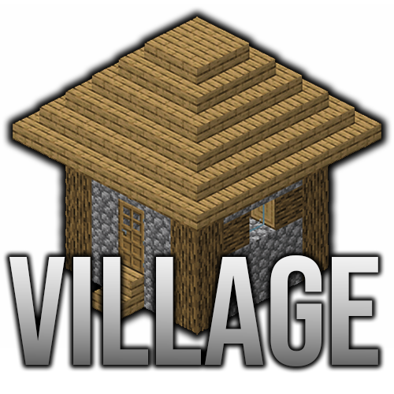
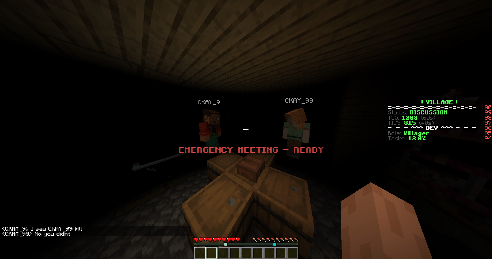
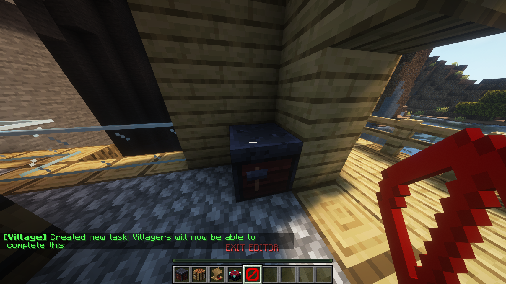
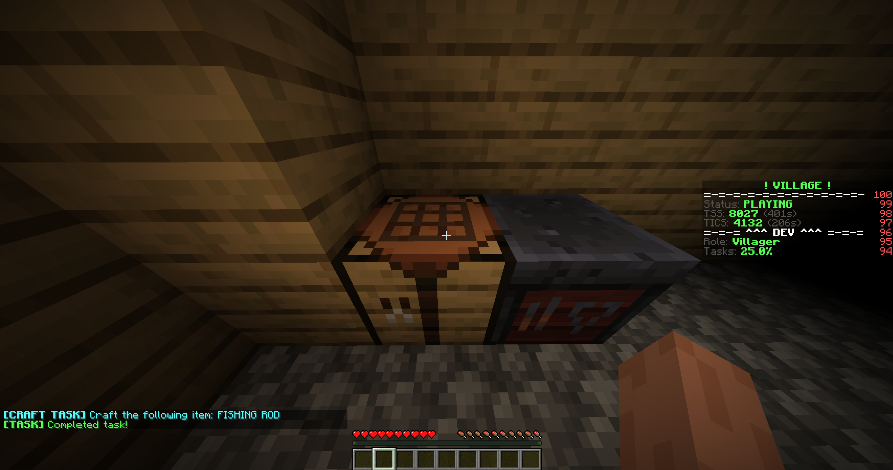

    

A Werewolf inspired deduction gamemode in Minecraft.

## What is Village?

Village is a Minecraft server plugin that introduces a new gamemode based off <a href="https://en.wikipedia.org/wiki/Mafia_(party_game)">Werewolf</a>, a deduction game similar to Among Us.

## Features

Village is full of features to ensure that gameplay is as smooth as possible.

### The Game

Village follows a very similar flow to Among Us. Players will move around, do tasks, etc. until either a body is found or a meeting is called.
Once a meeting is called, players will be teleported to the meeting teleport to discuss (I recommend using Discord for voice, but chat works fine).
They are able to evict a player by majority vote, or just go onto the next day.

    

#### Villagers

Villagers are the Crewmates of Village. They are given tasks and can have special roles like Medic (can revive dead bodies), Detective (can kill and check time of death).

#### Mobs

Mobs are the Impostors of Village. They are supposed to kill every Villager to win. Similar to the Villagers, Mobs are also able to have special roles like Sweeper (hides bodies temporarily) and Wizard (switches locations of people). 

### Editor

Before playing Village, you'll want to have a map you can play in. The Village Editor allows
server operators to place tasks, create and link vents together, and similar actions.

These editors can be accessed via the `/village task` and `/village vent` commands.

To exit the editor, simply use right click the exit tool or use the command `/village no-edit`.

    

### Tasks

As mentioned before, there are tasks in Village. These are no necessary to gameplay but do provide another win condition for the villagers; however, if there are tasks and all of them are completed without the win condition, the Villagers will receive compasses that point towards a Mob.

The generic tasks provided to are math (represented by a smithing table), trivia (represented by a lectern), and crafting (represented and uses a crafting table).

    

#### Math Task

A math task consists of two numbers, a and b, and a operand (e.g. +, -, *). The Villager will be
asked to solve a random equation made up of two numbers (-10, 10) and one of the three operators (division isn't included because rounding feels unfair).

Example: `What is -9 * 5?` The Villager will then type the answer in chat (not shown).

#### Trivia Task

A trivia task is a simple trivia question relating to general knowledge and Minecraft. General knowledge is a pretty subjective category, so I focused on Minecraft more, but hopefully it's fine.

Example: `Do pigs fly (yes/no)?` The Villager will then type the answer in chat (not shown).

#### Craft Task

A craft task requires the Villager to craft a specified item. They are given the required materials to craft the item.

Example: `Craft: DIAMOND HOE` The Villager will craft a diamond hoe in any crafting table.

#### Manifold Task

A manifold task requires a Villager to input the correct order of items (represented by lights in an inventory). They have to enter Light 1, Light 2, ..., all the way until Light 9.
If they fail to input the correct order, they fail the task.

#### Upload Task

Similar to Among Us' upload task, each map can have an upload task that every Villager has. It is a two part task where players must copy and upload for 20s total in two different locations.

#### Custom Task

A custom task is something server operators can add to Village. They are just custom versions
of the three generic tasks but can be made to be whatever you want.

### Debugging

Although a "secondary" feature, Village does offer a developer mode and verbose logging within the global config. Developer mode will ignore certain checks and similar things that would otherwise interfere with testing, make sure this is disabled if you just want to create and play Village. Verbose logging logs a large majority of interactions and things relating to Village, can be useful for debugging and knowing what's going on in-game. 

### Configuration

There is two different configs in Village. The first one is the global config. This is responsible for things like developer mode, verbose logging, or other plugin wide changes.
The other config is individual world/build configs. Server operators are able load and save configs by using the `/village load (id: optional)` and `/village save (id: optional)` commands.
By default, the ID is just the world name, but you can load any config from any world as long as you know the ID (check the `worlds.yml` file). To see all possible configuration options, check `/village` and the generated Village folder.

## How do I play Village?

All you need to do is download the latest release of the Village plugin (something like `village-1.x.x.jar`) and then placing it in your Spigot/Paper server's `/plugins` folder.

Once in-game, you are able to setup vents, a spawn and meeting location, tasks, and others. This allows you to create your own maps.

After everything is setup, you can get your friends together and play (or play by yourself, that's how I test it).
